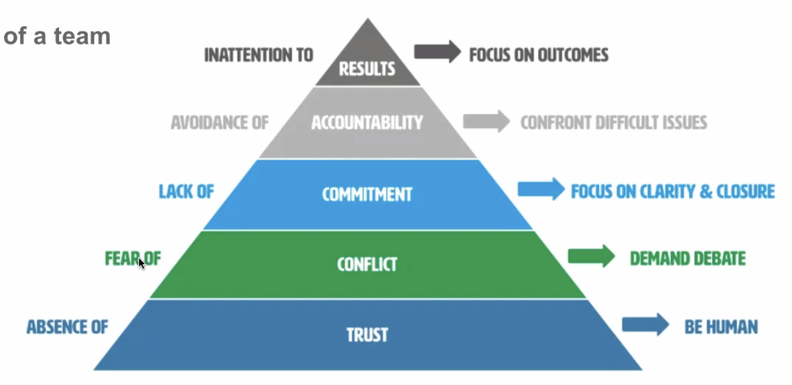

## 매니저 역할에 익숙해지기
- 결정을 내리는 것에 익숙해지기
  - 정보 부족을 핑계 대지 않기
    - 완벽주의에 빠지기 보다는 빠르게 결정하고 빠르게 실패해보자
  - 회사의 팀과 미션, 목표가 무엇인지 거기에 맞춰 빠르게 의사 결정
    - 나만의 의사 결정 원칙이 명확해지고, 팀원들이 이를 알게 된다면 팀원들 간의 의견 충돌도 적어진다
      - e.g. 아마존은 의사 결정이 One way door (한 번 결정한 후 되돌릴 수 없는 경우)일 때 판단하는 데 시간을 쓰고, Two way door (결정하고 다시 돌아올 수 있는 경우)일 때 빠르게 행동으로 옮기는 데 초점을 맞춘다.
- 도망가지 않기 (Be Present)
  - 현재에 집중하고 어려운 상황이나 이슈에서 도망가지 말 것
    - 내가 잘못한 것은 아니지만 내가 매니지한 팀원이 잘못한 경우, 매니저로써 책임을 지고 외부적으로 설명을 해줘야 한다.
    - 내부적으로는 사고를 막을 수 있는 액션 아이템을 만든다. 힘든 팀원들 옆에 있는 것만으로도 큰 도움이 될 때도 있다.
- 매니저의 중요한 역할은 안정을 주는 것
  - 일종의 심리 상담 (주간 미팅을 최대한 활용)
  - 일관성을 갖고 흔들리지 않기 (문제들과 슬기롭게 공존하기)
    - 매니저를 보고 팀원들이 안정을 찾을 수 있다.
- 많은 판단은 어느 정도 주관적이며 아주 객관적일 수 없음
  - 내가 지금 판단을 잘 하고 있는가 의구심을 가질 수 있지만, 그 상황에서 나만큼 아는 사람이 없다는 믿음을 가지고 빠르게 실행으로 옮기는 것이 좋다.
  - 결정이 틀린 경우 회고, 복기하고 잘못했다고 한 부분에 대한 실수를 반복하지 않도록
  - 잘못 내린 결정으로 인해 피해를 입은 사람이 생긴 경우 미안하다고 사과하기
  - 특히 사람에 대한 판단은 상대의 100% 동의를 받기 힘들다.

## Hiring Bar의 중요성
- “Steve Jobs has a saying that A players hire A players; B players hire C players; and C players hire D players. It doesn't take long to get to Z players. This trickle-down effect causes bozo explosions in companies.” - Guy Kawasaki
- 언젠가 내 경험과 인사이트가 모든 것을 커버하지 못하는 상황이 생길 수 밖에 없다. 이를 채워줄 수 있는 사람을 어떻게 뽑아서 함께 성장할 것인가를 고민해야 한다.
  - 파트너십과 역할 분담 (내가 약한 부분을 채워줄 수 있는 사람 찾기)
    - 나보다 경험이 많고 똑똑한 사람을 뽑는 것을 두려워하지 말고, 파트너의 관계로 생각하라.
  - 내가 가이드를 해준다기보다, 매니저로써, 리더로써, 어떤 일을 왜 해야 하는지 방향성을 설명해주고 막고 있는 걸림돌을 치워준다.
  - 서로 어떤 기대를 하고 있는지 명확하게 하기
  - Imposter Syndrome 경계하기
    - 모든 사람이 나보다 똑똑하니까, 내 자리를 빼앗아가는 게 아닐까?
    - 온보딩을 통해 성공하는 경험, 몰두하는 경험을 만들어주면 내 삶이 편해지고 다른 일에 더 집중할 수 있게 될 것이다
  - 내가 맡고 있는 팀의 파이를 키우는 데 초점을 맞추기

# 피드백 주기 (Crucial Confrontations)
## 피드백을 하기 전 기억해야 할 점
- 팀원과의 신뢰가 중요
- 팀원에 대한 관심이 중요
  - 미팅을 통해 팀원에 대해 많은 관찰을 할 수 있기 때문
  - 내가 매니징하는 사람이 20명이 넘는다: 좋은 피드백을 주기가 어려울 것.
  - 그 사람과 얼마나 많이 interaction하며 관심 있게 지켜보는가
- **내** 의견과 관찰에 기반
  - 누가 이렇게 이야기하던데~ 와 같이 남의 의견이라고 비겁하게 피드백을 제공하는 것을 지양
- 직접적인 피드백

## 신뢰 쌓기
- 신뢰가 기반이 되지 않으면 피드백은 먹히지 않는다.
  - 일단 상대를 믿어야 하고 선한 의도를 가져야 한다. (Good faith)
  - Five dysfuctions of a team
    - 
    - 신뢰 기반: 내 질문, 의견을 자신 있게 이야기할 수 있다.
    - 이를 통해 건강한 의견 충돌이 생길 것.
    - 결정이 내려지면 내 생각과 100% 일치하지 않더라도 논의 과정을 봤기 때문에 이해, 헌실할 수 있다.
    - 결국 좋은 결과가 있을 것이다.
- 1 on 1 미팅을 최대한 활용 (agenda 공유, relationship building...)
- 인간적인 모습을 보이는 것이 중요 (Show vulnerability)
  - 예를 들면 실수했을 경우 잘못했다고 이야기할 수 있어야 함
  - 모르는 것은 모른다고 해야 함
  - 팀 내의 질문을 장려하는 환경을 만들자: '이거 물어보면 멍청하다고 이야기하는 것 아니야?'라는 생각이 들지 않도록 하는 환경
- 공은 팀원에게 돌리고 사건, 사고의 책임을 질 수 있어야 함
  - 매니저가 되기 전에 개인으로써의 성과가 개인이 가져갈 수 있었는데, 매니저가 된 후 공을 자신이 가져갈 수 없는 것에 초반의 매니저는 힘들어한다
  - 하지만 karma, 공정한 매니저가 중요한 것은 소문이 나고, 소문을 통해서 조직 내에서 reputation이 좋아지기 때문이다.
- 중간 매니저와 신뢰를 쌓으려면
  - 큰 문제가 아닌 다음에는 직접 개입을 삼가하고 매니저를 통해 가야함
  - Don't break the line of command
  - 중간 매니저가 자신만의 스타일을 찾을 수 있게 도와줘야 한다
    - outgoing하는 매니저도 있는 반면, 소극적인 매니저도 존재한다.
    - 처음부터 잘하는 사람은 아무도 없다.
- 항상 되묻기: what do you think?
  - 내가 잘 아는 토픽일지라도 되묻는 것이 중요하다.
  - 그 사람의 생각이 내 생각보다 좋을 수도 있고, 함께 토론하며 더 좋은 아이디어가 나올 수 있기 때문이다.

## 다른 종류의 피드백들
- 스킬셋 피드백 vs 행동 양식 피드백
  - 스킬셋 관련 피드백
    - 주니어에서 시니어로 갈 때 더 중요
  - 행동 양식 피드백
    - 고치기 힘든 부분의 피드백, 시니어에서 그 위로 갈 때 더 중요
    - 내가 갖고 있는 패턴, 즉 'Comfort zone' 바깥으로 나가야 하기 때문에 어렵다
    - 개인에서 그룹으로 영향력을 증대하는 방향으로 가야 한다
    - 대부분의 개발자들은 매니저가 아닌 개발자로써 잘하기를 희망한다.
      - 하지만 개인에게 요구하는 것은 영향력이지, 뛰어난 코딩 능력을 요구하지 않는다.
      - 개발자라는 역할을 오래 수행하고 싶다면, 사람을 매니징하는 역할이 않더라도 리더십이 필요할 수 밖에 없다. 그룹에 끼치는 영향력이 중요.
      - 다수의 사람과 어울려서 일하는 것
- 긍정적인 피드백 vs 건설적인 피드백
  - 건설적인 피드백은 **신뢰**가 바탕이 되어야 하고 **매니저가 불편함을 견딜 수 있어야** 한다.
    - 상대가 동의했다면 이미 변했겠죠.. (뼈 맞았다ㅠ)
    - 이야기를 꺼내서 서먹서먹해질 수 있음을 알고 이를 감당할 수 있어야 건설적인 피드백일 수 있다.
- 레벨이 올라갈 수록 행동 양식에 관한 건설적인 피드백이 중요해진다.
  - 레벨이 올라갈 수록 내가 못해봤던 것을 잘해야 하는 경우가 존재
  - 내 성공 방정식, 내 comfort zone인 장점이 단점이 된다는 것을 사람들이 인정하기 어려워한다.
  - 정말로 성장하기를 바란다면 그 때 이것을 집어줘야 한다.
  - 당신의 장점이 지금은 단점이다. 변해야 한다는 이야기를 해야 한다.

## 피드백을 주기 전에 생각할 것
- 피드백의 핵심이 무엇인가?
  - 긍정적인 피드백과 건설적인 피드백 모두
  - 부차적인 요소는 제거하는 것이 좋음. 한 가지만 포커스
    - 건설적인 피드백일 수록 한 가지에만 포커스할 것
    - 여러 개를 이야기하는 순간 '공격 받는다'는 생각이 들 수 있다
- 이 피드백을 주는 것이 맞나? 아니면 let it go
  - Let it go하는 경우라도 같은 이슈가 자꾸 보이면 (패턴이 보이면) 피드백을 주는 것이 필요
    - e.g. 중요한 미팅에 10분 늦었을 때는 넘어갈 수 있으나, 두 번 세 번 반복된다면 본인을 위해서라도 이야기하는 것이 낫다
- 피드백을 준다면 피드백을 어떻게 줄지 생각
  - 여기서 중요한 점은 상대방을 내가 성장시켜야 하는 중요한 팀원이라고 봐야 한다는 점
  - 또 하나는 내가 꼭 옳다고 생각하지 않기
    - 해당 이야기를 처음 해보는 것이라면 더욱이 중요. 같이 이야기를 빠르게 함으로써 판단해보자.
    - 여기서 생각을 잘못하면 불편함이 혹시라도 생길까봐, 인간관계가 깨질까봐 뒤로 미루게 될 수 있고, 오해가 오해를 낳아 언젠가 감정적으로 터질 것이다. 작게 터트리 gap의 원인에 대해 이야기하는 것이 중요하다.

## 피드백의 중요성 - 매니저가 기억해야 할 점
- 장점을 최대화하고 단점을 최소화하는 것이 좋음
  - 하지만 장점이 단점이 되기 시작한다면?
    - 자신이 장점이라 생각하는 부분을 고치라고 하니 이해를 못하는 팀원들도 존재할 수도 있다.
- 긍정적인 피드백을 줄 때도 구체적이어야 한다
  - 왜 긍정적인지 이야기하자.
- 신뢰가 기반이 되지 않으면 피드백은 먹히지 않는다.
- 건설적인 피드백을 줄 때 감정을 섞지 말아야 하고 사람보다 **일**에 포커스
  - e.g. '너'는 왜 그렇게 일하는가라 하면 너라는 사람에 포커스하게 된다
  - 기대 (Expectation) -> 관찰 (Observation) -> 갭 (Gap)
    - 내가 기대했던 바는 이것인데, 관찰한 바는 이것이다. 그 사이의 '갭'에 대해 이야기해보자.
  - 내가 옳다고 생각하는 것이 아니라 갭을 찾는데 집중
    - 진짜 갭이 존재하는 것인지, 아니면 내가 잘못 관찰한 것인지 갭을 줄여나가야 한다.

## 피드백을 줄 때 사용하지 말아야 하는 방법: 간접적인 비난
- 장점 -> 단점 -> 장점을 번갈아 이야기하기: 샌드위치 기법
  - 듣는 사람 입장에서는 혼란스러울 수 있다. 내가 이야기하고 싶은 포인트가 무엇인지 판단이 어려울 수도
  - 심리적으로 안정을 줄 수 있는 이야기를 주는 것이라면 의미가 있을 수 있지만, 단점만 이야기하기 뭐하니까 장점을 이야기한다면 bad
- 바디랭귀지로 불만 표출하기 -> 얼굴 찡그리기, 한숨 쉬기, 비웃기
- Good Cop 역할을 하면서 다른 사람의 의견 이야기하기 -> 누가 이러더라...
  - 내가 납득이 되지 않는다면 이야기할 필요가 없다. 웬만하면 내가 관찰하고 이해한 바로 하는 것이 좋다.
- 내가 무슨 이야기를 하려고 하는지 맞춰보라 (Read my mind!)
- 결론: **내가 그 사람을 신뢰하고, 잘되기를 바라는 마음을 바탕으로 일에 포커스해서 내가 옳다고 속단하지 말고, 갭에 대해 이야기하며 갭을 줄이는 방법에 대해 같이 이야기하면 좋다.**

## 건설적 피드백을 주는 방법
- Private meeting
- Ensure safety!
- Two Important Points
  - A Common Purpose
  - Mutual Perspect
- 건설적인 피드백을 줄 때 감정을 섞지 말아야 하고 사람보다 일에 포커스
  - 갭을 어떻게 줄여갈지 판단하고 논의
  - 팀원의 변하가 필요한 것(기술 또는 행동양식)인지, 내 변화가 필요한 것인지
    - e.g. 여러 번 반복했다고 생각하더라도 팀원들이 이를 기억하고 일하는 경우는 없다. 말을 덜하는 것의 중요성, 중요한 것은 그만 좀 이야기하라고 이야기할 정도로 반복하자. 매니저로써 커뮤니케이션을 분명하게 해야겠구나라는 것을 생각하게 된다.
- 상대방이 바뀌어야 한다고 생각된다면
  - 갭으로 인한 문제에 대해 이야기 -> 임팩트
    - 조금 더 확신을 가지고 '어떻게 변해야 하는지' 이야기해야 한다
    - 그런 행동을 보임으로 인해 팀 전체의 분위기가 나빠지거나, 특정한 행동 양식을 보임으로써 reputation이 나빠지거나, career 자체가 나빠질 수 있다. 결과에 대해 이야기.
      - 매니저 관점에서 어떻게 변화하면 좋을지, 변화를 어떻게 하면 좋을지 이야기를 하면 좋다.
    - 그래도 상대방이 안 바뀐다면?
      - 동기부여의 문제인지?
        - 별로 관심이 없는 일을 맡은 것인지, 아니면 밖에 더 재미있는 일이 생겼는지.. 이런 일은 서로 친해지면 알 수 있게 된다
      - 결국 평가, 보상이란 형태로 표출이 되어야 한다
        - 미국이라면 해고를 하면 된다. 해고라는 것이 노동 시장이 유연한 곳에서는 결코 나쁘지 않다. 한국에서는 일을 잘하고 변화하는 사람에게는 보상을 해주고, 못하는 사람에게는 보상을 줄여나가는 것이 맞지 않을까.. 생각한다.

# 개인적인 피드백 이야기
## 시니어 엔지니어
- 완벽주의 성향으로 모든 일을 정해진 형식으로 진행하던 시니어 엔지니어
  - 모든 일을 똑같은 강도로 진행하다보니, 맡고 있던 프로젝트 자체가 문제가 되기 시작
- 기대: 중요한 일을 더 열심히 하는 것
- 관찰: 모든 일을 열심히 하고 있다
- 갭: 우선 순위를 고려해서 노력을 달리 하는 것. 리드이기 때문에 그로 인한 임팩트가 더 클 것이다.
- 개선계획
  - 본인의 과거 성공 방정식이 지금도 성공 방정식이라 이해하고 있었음.
    - 행동 양식이 변화해야 한다는 피드백은 시니어일 수록 자신의 장점이 성공 방정식이라 생각하기 때문에 반응이 좋지 않다. 하지만 이것이 바뀌어야 다음 스텝으로 넘어갈 수 있다.
  - 그 Comfort zone 밖으로 나가기. 자신의 루틴과 다르게 일처리하기.

- 발생할 불편함을 견뎌야 하고 초반에 이야기했어야 했는데, 그러지 못하고 참다가 나중에 폭발했던 경우.
- 뚜렷한 피드백을 주지 않고 연봉 인상을 높게 하지 않았을 때, 팀을 나가버린 경우.
- 앞에 실수를 해야 더 나은 피드백을 줄 수 있다.
- 실수를 두려워하지 말고, 실수를 하고서도 '나는 매니저를 하면 안된다'고 판단하지 말아달라.

## 주니어 엔지니어
- 일을 열심히 하는데 성과가 딱히 안 나오는 엔지니어
- 기대: 완료한 일들에서 성과가 나오는 것
- 관찰: 일들이 빠른 속도로 완료되기만 함
- 갭: 일을 빠르게 완료하는 것이 중요한 것이 아니고 임팩트를 내는 것이 중요한 것
- 개선계획
  - 질문을 통해 문제 정의를 잘 하고 우선순위를 고려해서 일하기
    - 스프린트에 내가 맡은 태스크를 체크하는 것에 집중하고 있었음.
    - 10개 중에 임팩트를 낼 수 있는 것에 집중해야 하고, 이를 위해서는 질문을 해야 한다.

- '일을 잘한다'의 의미를 명확하게 이해하지 못한 친구였다

## 인턴
- 팀 플레이어이고 유쾌하고 설명을 잘하지만 코딩을 못하던 인턴
- 기대: 피드백을 주면 그에 맞게 변화하는 모습
  - unit test, coding convention, bug를 잡을 때 처음부터 다시 코드를 작성해봐라 등의 피드백을 주었다
- 관찰: 시간이 조금 지나면 다시 원래대로 돌아감
  - 일주일 정도만 유지됨
- 갭: 동기부여의 부족. 코딩에 큰 흥미를 못 느끼고 있었음
  - 본인이 CS 전공이었지만 왜 하는지 몰랐다.
- 개선 계획: 내가 좋아하는 것은 무엇인지? 나에게 더 맞는 것 찾아가기
  - Sales Engineer가 되면 어떠한가?

- 그 사람이 더 open해서 이야기할 수 있다면 더 좋은 path를 찾아갈 수 있었다

## 데이터 사이언티스트
- 뛰어난 능력을 가졌지만 모든 걸 본인이 해결해야 직성이 풀렸던 시니어
- 기대: 팀내 이미 구성된 인프라를 이용해서 자신이 맡은 일을 빠르게 수행하기
- 관찰: 이미 있는 인프라를 여러 가지 이유를 대면서 새로 만들기, 이 과정에서 기존 팀원들과의 불화 야기
- 갭: 본인이 들이는 노력 대비 결과물의 품질이 높지 않다는 점에 대한 인식의 부족
- 개선 계획: 팀 내 인프라로 일단 빠르게 시작해보기, 혼자 다 해결하지 말고 도움을 요청하고 상황을 더 자주 공유하기
  - 논문은 오랜 시간 동안 작성하다보니 마인드셋 자체가 waterfall. 오래 진행하면서 만드는 것에 익숙했던 케이스.
  - iteration을 돌면서 조금씩 개선해보자고 이야기.

## 생각해볼 점
- 내가 만약에 매니저라면 변화해야 할 사람은 어떤 사람이고, 기대 -> 관찰 -> 갭 -> 개선 계획을 어떻게 제시할 것인가?
  - '이런 부분이 바뀐다면 한 단계 성장할 수 있다'는 부분을 고민해보자

# 일대일 시간 활용
## 많이 듣고 말할 때는 명확할 것
- 항상 되묻기 (Ask Back)
  - What do you think?
  - 단답으로 말을 하더라도 계속 말을 시키면서 조금씩 늘려가는 것이 좋다.
  - 중요한 것은 '한 번 이야기했다고 이를 올바르게 이해하지 않는다'
- 팀원이 이야기를 많이 하게 하는 것이 키
- 중요한 메세지는 반복하기

- 일부의 사람이 말을 주도한다 싶으면 제지하고 다른 사람의 의견도 들어봐야 한다
  - e.g. 돌아가면서 이야기를 해보자, ㅇㅇ님은 어떻게 생각하세요? 등

## 일대일 미팅의 초점
- 신뢰를 쌓는 자리
- 조금 더 구체적인 이야기
  - 일반적인 프로젝트 진행을 이야기하는 자리가 아니고 구체적인 문제나 방향성 등을 이야기하는 자리
    - 건설적인 피드백이나 다른 사람, 팀과의 충돌 등을 논의하는 자리
  - 매니저로써 도와줄 수 있는 부분이 있는지 혹은 보호막이 되어야 하는 일이 있는지 파악
    - What can I do to better help or support you?
      - '힘든 일 있어요?'보다 '내가 도와줄 수 있는 일이 있는가?' 물어보자.
      - 1대1 미팅을 꾸준히 하게 된다면, 언젠가 도와달라는 이야기를 할 수도 있다.
    - How am I helping you be successful?
- 조금 더 개인적인 이야기
  - 주기적으로 커리어에 대해 논의하는 자리 (예를 들면 한 달에 한 번)
  - 일 밖에서 생기는 문제가 있는지 파악
  - 서로의 과거 이야기를 하는 것도 좋다.

## 일대일 미팅 관련 팁
- 기록할 것!
- 바디 랭귀지도 살펴볼 것 (불안감)
- 바빠도 취소하지 말고 최악의 경우 다시 시간을 잡아보거나 미리 알려줄 것
- 별 토픽이 없을 때 할 수 있는 이야기거리 만들기
  - 커리어 목표
    - 없는지 있는지? 없다면 생각을 안해봤는지, 아니면 있는데 자신이 없어서인지? 등등
    - 동기붕?
  - 팀 개선점 (협업방식)
    - Retrospective 미팅 때 팀원이 했던 이야기 중에 insightful한 것이 있다면 그걸 깊게 파보기
    - 미팅을 어떻게 더 효율적으로 할까? 쓸모 없는 미팅이 있나?
  - 개인사 이야기해보기 (전공을 선택하게 된 계기, 가장 좋아하는 취미, 여행 이야기)
    - 예1. 지난 주말에 뭐했는지, 다음 주말에 뭐하는지 물어보기
    - 예2. 아이가 있다면 요즘 무엇에 흥미가 있는지 물어보기
- 마지막에 항상 무엇을 도와줄 수 있는지 묻기

## 다른 종류의 일대일 미팅들
- 다른 팀과 협업 프로젝트가 있는 경우
  - 협업하는 팀들의 매니저들과 주기적으로 만나기
- 매트릭스 조직 하에서 팀원들이 목적 조직에서 일하는 경우
  - 목적 조직의 매니저와 주기적으로 만나기

## 추천하는 책들
- First Break All The Rules
- Built to Last
- Crucial Conversations
- Crucial Confrontations
  - 피드백을 주는 방법
- The First 90 Days
  - 온보딩
- 5 Dysfunction of a Team
- Management 3.0
- The manager's path (개발 7년차 매니저 1일차)
- Radical candor
- Multipliers
- The making of the manager

## Q&A
### 피드백
- 기술에 대한 피드백을 주기 위해 필요한 역량?
  - 문제 정의를 잘하고, 어떤 의미 있는 일을 하면 되는지 방향에 대한 피드백을 주는 것으로 충분하지 않을까
- 부정적인 내용의 피드백 (ex. 퍼포먼스가 기대치에 못 미침)은 어떻게 잘 전달할 수 있을까요?
  - 불편함을 견디고, 내가 관찰한 것이 맞다는 전제 하에 갭에 대해 이야기를 해보자. 이 팀원은 자기가 잘하고 있다고 생각할지도 모른다. 연봉 인상 폭이 작을 경우 이에 대해 실망할 수 있으니, 감정을 넣지 않고 이야기해보자.
- 신뢰를 쌓기 어려운 상황에서 건설적인 피드백을 주는 것은 어려울까?
  - 평판이 중요하다. 내가 틀릴 수 있다는 가정 하에 갭을 줄여보자.
- 선한 의도는 사실 주관적인 것이고 감정적인 것이라서, 실제로 좋은 방법일지라도 객관적으로 전달할 수 있어야 한다고 생각하고, 그렇지 않으면 효과가 없을 것 같습니다. 선한 의도를 어떻게 표현할 수 있을까요?
  - 사실 그런 상황과 딜레마에 빠지게 된다면 매니저 관점에서 내가 할 수 있는 행동이 별로 없다.
  - 선한 의도를 보여주려면, '신뢰'가 필요하다. 거기서 만든 reputation은 나를 따라다닌다.
    - 팀원들의 의견을 잘 듣고, 결정할 때는 명확하게 결정하자. 어떻게 움직일지 이야기하고 이를 허심탄회하게 나누는 시기를 빠르게 만들어야 한다.

### 소통
- 개인 주장이 너무 강한 팀원과의 1:1 대화 문제.
  - 우선, 해당 인원이 개인 주장이 너무 강하다는 사실을 잘 인지하고 있는가?
    - 이에 대해 동의한다면, 이를 해결하는 action plan을 제시하자.
    - 아니라면, 특정한 상황을 예로 기대 - 관찰 - 갭을 이야기해주자.
- 성과 개선에 도움이 되면서도 기분도 상하지 않게 커뮤니케이션하는 방법이 있을까요?
  - 매니저의 책임은, 팀원이 성장하는 길을 만들어주는 것.
  - 이 이야기를 꺼냄으로써 관계가 망가지지 않을까? 보다는 선의를 바탕으로 발전하기를 원하는지 이야기하자.
- 개인사를 이야기하기 싫다고 이야기하는 팀원과는 어떻게 소통할까?
  - 업무와 관련된 이야기 중심으로 할 수 밖에 없다.

### 매니징
- 한국의 매니저는 실무와 매니징을 함께 하는데 실리콘 밸리는 맬리징 업무를 전문적으로 하는 것 같습니다. 매니징 업무에 대한 지식은 어떻게 쌓아서 시작하게 되는 걸까요?
  - First Line Manager도 실무와 매니징을 하게 된다.
    - 팀의 크기가 크지 않았기에 쉬웠다.
  - Second Line Manager는 매니지를 전문적으로 하게 된다.
    - 중간 매니저를 거쳐서 이야기해야 하기 때문에.
  - 책을 많이 읽어보고, 존경할만한 매니저를 멘토로 삼으세요. 그리고 실수를 하세요.
    - 실수를 하지 않고 발전하는 사람은 없다.

### 기타
- 실패를 했을 때 좌절감이 클텐데 어떻게 극복하셨는지 궁금합니다.
  - 2년 정도 고생하고 창업을 망했는데, 좋은 느낌은 아니었다.
  - 또 다른 느낌으로 이야기하면 '해보고 싶은 것을 해봤다' 창업에 대한 호기심이 사라졌다. 다시 하지 말아야겠다!
  - 어떤 관점으로 바라보는가.. 가 중요한 것 같다. 나에게 맞는 것을 찾아가는 과정.
  - 무엇을 배웠는가, 배운 것을 다음 번에 어떻게 쓸 수 있을까의 관점으로 바라보면 좋겠다.

- 다른 팀을 매니지해야 하는 경우 어떻게 해야 하는가?
  - 많은 경우 그 팀에 문제가 많았고, 팀에 들어가기 전 힘들 것을 예상하고 들어가야 한다.
  - 그 팀에 대한 이야기를 많이 들어야 한다. 원래 매니저가 왜 나갔는가? 매니저가 나간 이후 왜 승진이 이루어지지 않았는가?
  - 그 팀에서 신경써야 하는 사람을 파악, 그 사람들을 어떻게 할 것인가.
  - 어떻게 팀이 굴러가는지 모양을 관찰하고, 그 다음 변화를 만들어내는 것이 좋다.