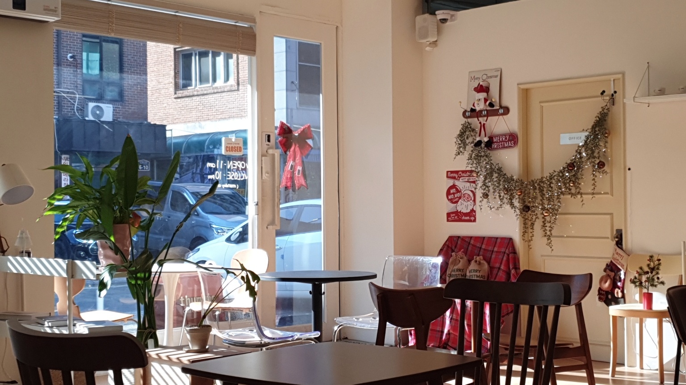
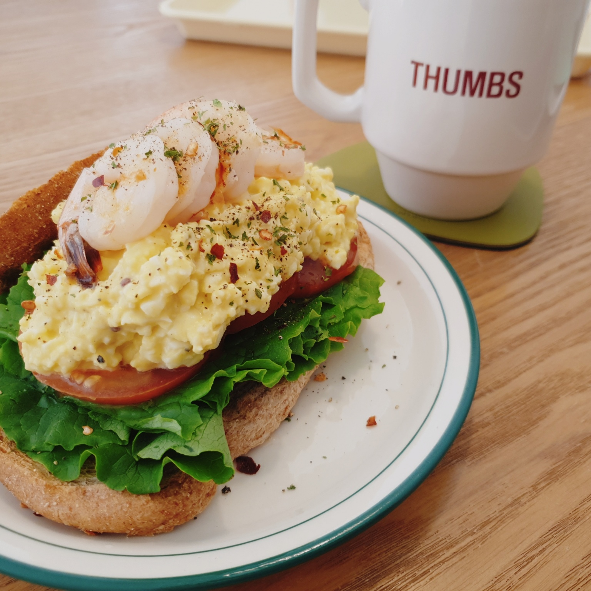

(09:30 ~ 11:00)  
늦잠을 자려고 했는데 9시 반 정도에 눈이 떠졌다.  
침대에 누워 핸드폰을 한시간 정도 했나.. 부랴부랴 집안일을 해치우고 카페로 향했다.

동네에 분위기 좋은 카페가 있다는 것은 큰 축복.  
누군가의 취향으로 꾸며진 공간을 방문한다는 것은, 언제나 기분 좋은 일이다.  

(11:30 ~ 15:00)  
세 권의 책을 동시에 읽어보았다. 한 권은 소설, 한 권은 수필, 그리고 나머지 한 권은 정보 전달.  
나름 다른 분야의 세 책이라 내용이 겹치는 느낌도 들지 않고 지루할 때마다 책을 돌려보니 시간 효용이 좋은 듯 하다.  
앞으로 종종 써먹어야지.  

'자본주의는 교환이다'라는 문장이 기억에 남는다.  
교환하지 않은 자본은 더 큰 자본을 불러오지 못한다.  

(15:00 ~ 15:40)  
탄천 산책을 했다. 운동 해야지 말은 계속 떠올리는데, 컨디션 난조와 추운 겨울 이슈로 미루고 있다.  
다음 주부터는 걷기 운동이라도 시작해야지 다짐해본다.

(16:00 ~ 16:30)  
깃허브와 링크드인 관리를 잠시 진행했다.  

(16:30 ~ 19:50)  
Next.js 공부를 몇 시간 진행했다.  
중간 중간 배고파서 남은 마라탕과 뻥튀기, 그리고 귤 2개를 집어먹었다.  
이렇게 적어두고 보니 생각보다 많이 주워먹었네;

(20:00 ~ 22:30)  
잘 만든 인터렉티브 사이트들을 탐방하고 디자인을 참고해보았다.  
색상, 폰트, 그리고 적당한 배열. 디자인은 감각이 필요한 분야라는 것을 절실히 깨닫는다.  
디자인에 대한 감각이 필요하다는 생각이 들었다면, 좋은 디자인을 많이 접해봐야지.  
behance나 dribbble을 자주 들어가봐야겠다는 생각이 든다.  

간만에 술에 찌들지 않고 보람찬 주말을 보내서 기록해보고 싶었다.