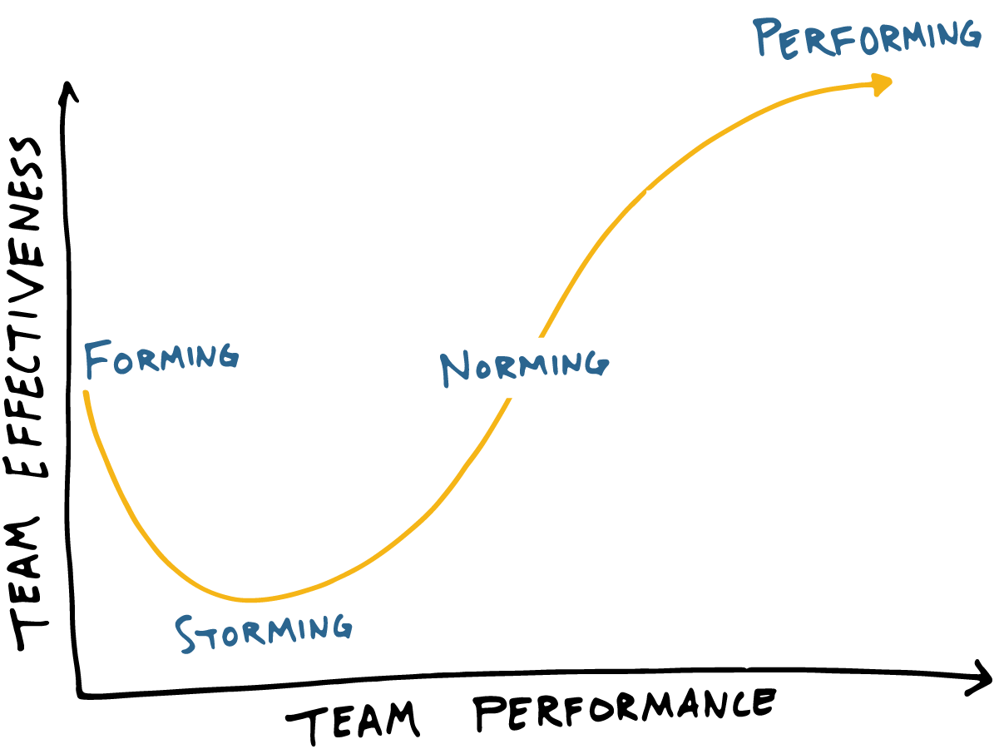

## 왜 이 책을 읽기 시작했는가

개발자로 일하며 관련된 키워드를 이곳저곳에 검색하다 보면, 아무래도 알고리즘 자체도 한쪽으로 skew되게 된다. 
한동안 내 유튜브에 떴던 영상들은 주로 개발자로 어떻게 살아가는지에 대한 내용인데, 유튜버 조코딩 님의 '블리자드 레전드 개발자의 30년 압축 핵심 노하우'도 그 중 하나였다.

https://youtu.be/u1ByKUip9q0

해당 영상은 꽤나 길이가 긴지라.. 언젠가 시청해야지 하고 재생목록에 저장되어 있었는데 어느 순간 갑자기 생각이 나 다시 찾아보게 되었다. 영상의 중앙에는 인터뷰어이신 박종천 님의 저서, '개발자로 살아남기'였고 도서관에서 빌려 읽어보기 시작했다. 
여담이지만, 성남시는 정말 도서관 시스템이 잘 되어있다. 원하는 책을 몇 일 내에 빌려 무료로 읽어볼 수 있다는 것은 큰 행운.

## 책을 읽고 느낀 점
- 개발자로써 갖춰야 할 역량에 대한 정보를 얻었다기 보다는, 앞으로의 인생을 살아가는 데에 있어서의 북극성을 제시해줬다다. 
- 본래도 개발자 커리어를 바탕으로 기획과 프로젝트 매니징으로 옮겨 갈 생각이 있었는데, 해당 커리어에 대한 조언을 얻을 수 있었다. 
- 시간 관리는 열심히 하자.. 나를 믿고 아자아자

## 프롤로그 - 개발자 30년을 넘어서
> p9. 저는 코딩에만 집중하는 '100세 코딩'보다는 성장하는 '30년 커리어패스'를 개발자께 제안드립니다. 처음 10년은 실력을 쌓으며 성장하는 시기, 다음 10년은 다른 개발자를 리딩하며 일하는 시기, 마지막 10년은 한 발 물러서서 사람들을 돕고 서포트하는 시기입니다.

> p12. 저는 농담으로 디렉터를 정의하며 이런 표현을 씁니다. "모든 일을 할 수는 있지만 아무 일도 하지 않고 대신 모든 일에 책임지는 사람"이라고요. 단순히 일을 하는 사람이 아닙니다. 책임질 줄 알아야 하는 사람입니다. 그러려면 모든 것을 파악하고 옳은 결정을 빠르게 내릴 수 있어야 합니다.

> p13. 성장은 무엇일까요? '성장'은 역량이 늘어난다는 뜻입니다. 사람의 '역량'이란 무엇일까요? 첫 번째는 지식, 두 번째는 숙련도, 마지막은 경험입니다.
> 첫 번째, 지식은 공부를 해야 쌓입니다. 지식을 쌓는 공부는 혼자서 하는 영역입니다. 
> 두 번째, 숙련도는 같은 일을 여러 번 오래 반복해야 쌓을 수 있습니다. 결국 프로그래밍, 프로젝트, 소통, 협업을 해봐야 숙련도가 높아집니다. 얼마나 열심히 하냐에 따라 공부와 숙련에 드는 시간이 짧아질 수 있습니다. 
> 반면 경험을 쌓는 데 드는 시간은 단축하기가 어렵습니다. 경험은 성공과 실패를 해봐야 하고, 이런 사람 저런 사람도 만나봐야 합니다. 
> 항상 지식과 숙련도를 고민하고, 특히 간접 경험을 적극적으로 받아들여 경험을 쌓으면 앞서 언급한 커리어패스를 더 빠르게 밟아나아갈 수 있습니다.

## PART 1 - 엔지니어링 역량
### 01 개발자의 소양
> p34. 소프트웨어를 개발하면서 출시에 대한 why, how, what, who, when을 종합적으로 고려해야 합니다. 어떻게에 매몰되면 좁은 영역에서 해결책을 얻을 수는 있지만 종합적인 관점에서 최고 혹은 최선의 해결책을 얻지 못합니다. 크리티컬 싱킹은 종합적인 관점에서 해법을 구하는 습관입니다. 같은 시간을 투자해도 상대적으로 더 큰 성장을 이끌어냅니다. 
> (...) 나의 주인의식을 가져보세요. 과거에 내가 한 일이 오늘의 나를 만듭니다. '그냥 시킨 것만 했어요'라고 대답하지 않으려면 나에 대한 주인의식, 즉 크리티컬 싱킹이 필요합니다. 그런 기여가 결국 나를 자연스럽게 성장시킨다는 거죠. 

> p39. '1년 안에 느는 영어가 당신의 모든 영어다.' 1년이 지나면, 언어가 안 통해도 일이 됩니다. 그러고는 영어가 늘지 않게 됩니다. 개발자 커리어패스 30년 중에서 처음 10년, 모르는 게 가장 많은 시기에 최대한 많이 깊게 공부하세요. 기본 지식이 선입견이 되고, 나이 먹게 되면 새로운 걸 받아들이는 속도가 느려집니다.  

### 02 고객이 원하는 제품 디자인
> p45. 하늘 아래 완전히 새로운 제품은 없습니다. 카피만 해서는 경쟁 제품을 이길 수 없습니다만, 경쟁 제품의 장점과 단점을 파악해서 장점을 도입, 개선하고 단점을 보완한다면 사용자에게 좋은 제품을 제공할 수 있습니다. 
> (...) 경쟁 제품 분석에는 디테일에 신경을 써야 합니다. 단순하게 '이렇게 동작합니다'라고 정리하는 건 의미가 없습니다. 그렇게 설계한 이유를 밝혀내고 사용자가 어떻게 사용할지 그리고 만족할지 등을 충분히 시간을 들여서 분석해야 합니다.

> p46. 고객 여정으로는 인식, 고려, 결정, 유지 단계가 기본입니다. 설계대로 여정이 진행되는지를 데이터를 기반으로 모니터링하고, 그 결과를 기반으로 개선해야 합니다.

> p49. 데이터 주도 개발이란 제품 출시 이후에도 지속해서 데이터를 모아 모든 과정에 데이터를 사용하는 겁니다. 제품 개발 초기 단계부터 데이터 수집 계획 및 설계를 제대로 마련하고, 수집한 데이터를 가공해 개발팀이 활용할 수 있게 해야 합니다. (...) 성능과 충분한 데이터 사이에 균형을 맞추어야 합니다.

> p50. Dogfooding이라는 말이 있습니다. 'Eat your own dog food'라는 말에서 유례했으며, '본인이 만든 제품을 직접 써보라'라는 격언이 되겠습니다. 내가 만드는 제품에 대한 이해가 중요하다는 의미의 문장입니다. 써본 만큼 이해가 깊어집니다. 이해한 만큼 더 나은 제품을 개발할 수 있습니다. 

### 03 30년간 실천할 개발 주기
> p62. 도구는 결국 프로세스를 구체화하는 겁니다. 어떻게 애자일한 프로세스로 일할 것인가를 고민한 후 알맞은 도구를 사용하면 됩니다. 

> p63. 애자일이 원활히 동작하려면 적극적인 소통이 중요합니다. 시킨 일만 하는 수동적인 자세로는 불가능하다고 해도 과언이 아닙니다. 소통은 모든 방향에서 원활히 이뤄져야 합니다. 

## PART 2 - 매니지먼트 역량
> p71. 프로젝트 관리는 기본적으로 비용(리소스/인력), 시간(출시일), 제품 범위(기능) 세 가지를 관리하는 겁니다. 

> p72. 팀의 핵심은 신뢰와 지식입니다. 새로 결성된 팀에서 처음 만난 사람들은 당연히 서로를 신뢰하지 않습니다. 그래서 지식도 공유하지 않습니다. 그러다 조금씩 자기가 하고 싶은 말을 하고, 본인의 지식을 전하게 됩니다. 아직은 서로를 신뢰하지는 못하기 때문에, 상대방 말이 기분 나쁘게 들립니다. 그래서 싸움이 생깁니다. 싸우다 보면 결국 친해집니다. 친해지면 신뢰가 생겨서 다른 사람의 지식을 믿고 잘 협력하게 됩니다. 비로소 팀이 잘 돌아가게 되고, 시너지가 발생합니다. 

> p74. 워크숍 때마다 남들이 써줬으면 하는 자신의 장점을 말하게 합니다. 약점도 말하게 하되, 자신의 약점을 어떤 방식으로 도와줬으면 좋겠는지 말하게 합니다. (...) 팀 존재 이유는 서로의 장점을 공유해서 극대화하고 약점을 보완해주는 것이므로, 서로가 강점과 약점을 알아야 합니다. 특히 약점을 공격하는 데 사용하면 안 됩니다. 약점은 당사자를 보호하고 팀워크를 유지하는 데 사용해야 합니다. 팀 생성 초기에 이 워크숍을 진행하면 빠르게 신뢰 단계 (규범기)로 진입해 원활히 지식을 나누게 됩니다.

> p75. 훌륭한 개발자는 절대 엔지니어링 역량만 가지고는 될 수 없습니다. 매니지먼트 역량이 꼭 필요하고 이 매니지먼트 역량의 바탕은 바로 soft skill입니다. 제일 기본인 다섯 가지 기술은 소통(communication), 협업(teamwork), 긍정적인 자세(positive attitude), 프로 의식(work ethic), 그리고 리더십(leadership)입니다. 

> p79. 리더십이라는 역량은 많은 것을 포괄합니다만 그중에서 하나만 꼽으라면 인사이트입니다. 탁월한 인사이트를 갖춘 리더라면 향후 변화의 큰 물줄기를 발견해 흐름에 올라탑니다. 인사이트가 있어야 기술 변화를 내다보고, 개발 방식과 방향을 결정할 수 있습니다. 
> (...) 인사이트를 어떻게 계발할 수 있을까요? 저는 책과 사람 그리고 크리티컬 싱킹을 제안해봅니다. 좋은 책을 계속 읽고, 좋은 사람을 계속 만나야 합니다. 이렇게 해서 얻어진 것들을 실제 업무에 적용해보고, 크리티컬 싱킹을 해서 계속 확장해야 합니다. 투명하게 지속적으로 본인의 인사이트를 전파하고 개방성을 발휘해 다시 좋은 피드백을 듣고 반영해야 합니다. 그래야 혼자만의 생각이 아닌 집단 지성을 이끌어내며 발전할 수 있습니다.

### 04 성공을 이끄는 프로젝트 리드
> p89. 역할을 맡은 사람이 일을 잘할 수 있게 코디네이션하려면, PM은 사람들이 적절히 부딪히며 일할 수 있게 역할을 정의해야 합니다. 완벽히 격리된 역할을 주면 의욕이 떨어지고, 역할 이기주의에 빠질 수 잇습니다. 그러면 큰 그림에서 협동이 어렵습니다. 모든 사람에게 기본 역할을 정리해주되, 약간은 자기 범위 밖에 나와서 일할 수 있도록 자유를 제공해야 합니다. 사람들이 자연스럽게 자기 밖으로 나와서 이야기하고, 생산적인 충돌이 일어나도록 해야 합니다. 

> p91. 생산성을 올리는 방법은 모두를 바쁘게 하는 것이 아니고 낭비를 없애는 겁니다. 모두가 바쁘고 진척이 안 된다면 사실상 낭비하고 있을 가능성이 높습니다. 가능한 모든 곳에서 낭비와 병목 요소를 없앱시다. 그러면 빠르면서도 모두가 적절한 업무량으로 일할 수 있게 됩니다. 

> p94. 모든 일에서 목표, 계획, 실행, 측정 이 네 가지는 중요합니다. 목표가 있어야 의미가 있는 것이고, 계획이 없으면 무엇도 할 수가 없으며, 실제 실행해야만 뭐든 결과가 나옵니다. 모든 결과를 측정, 분석해서 더 좋은 목표로 수정하거나 아니면 계획을 더 좋게 바꾸어서 다시 실행해 원하는 결과가 나올 때까지 이 과정을 반복해야 합니다. 

### 05 기술 주도 테크니컬 리드
> p101. 개발은 미지의 영역을 개척하는 일이 다반사입니다. 남들이 이미 만든 것을 똑같이 만들어서 출시하며 성공할 확률이 낮습니다. 아무도 가지 않은 길을 가야 합니다. 

> p102. 개발에서는 일을 필요한 일과 하고 싶은 일로 나누고, 또 아는 일과 모르는 일로 나눕니다. 필요한 일을 우선 진행하고 나서, 원하는 일을 추가해야 합니다. (...) 필요한 데 모르는 일에는 리소스가 얼마나 투입될지 알 수 없기에 이를 먼저 해야 합니다. 어렵고 큰 일, 모르는 일을 먼저 해야 합니다. 성공을 목표로 한다면 어려운 문제를 먼저 푸는 게 좋습니다.

> p103. 속도보다 방향이 중요하므로, 항상 올바른 방향으로 가고 있는지 점검해야 합니다. 속도가 너무 빠르다면 점검해야 합니다. 달리면서 방향을 정하는 일은 거의 불가능에 가깝습니다. 그래서 한 번씩은 멈춰 서서 자신이 올바른 곳으로 가는지, 방향이 맞는지 확인해야 하고, 이 확인 작업을 짧은 주기로 자주 해야 합니다.

> p107. 기술 자산 실사 질문 - 투자자 입장의 질문들
> 1. 개발 역량은 있는지?
> 2. 프로젝트 관리 능력은 있는지?
> 3. 출시 후 운영 능력은 있는지?
> 4. 확장성이 좋은지? 단일 장애점이 있는지?
> 5. 보안은 잘 되고 있는지?
> 6. 플랫폼은 무엇을 쓰고 있는지? 클라우드는 어떻게 활용하는지?
> 7. 미래에 생길 수 있는 위험 요소는 없는지?

> 이와 별개로 Joel's Test는 개발자 입장에서 기술력을 확인할 수 있는 질문입니다.

### 06 행복을 만드는 피플 매니저
> p112. 좋은 피플 매니저가 되려면 사람에 대한 마음이 있어야 합니다. '결국 다른 사람들이 행복했으면 좋겠다', '다른 사람들이 일을 잘해서 만족감을 느꼈으면 좋겠다'를 생각하는 사람이죠. (...) 여러분이 지금 팀장이라면 세 가지 중에서 자신이 진짜 사랑하는 것이 무엇인지 생각해보기 바랍니다. 제품인지, 기술인지, 사람인지에 따라서 본인의 커리어패스를 생각하세요.

> p113. 사람은 저마다 성향이 있습니다. 관리자라면 Why, What, How 성향을 골고루 배치하는 것이 좋습니다. 
> - Why 성향은 질문을 던집니다. (고객 집중)
> - What 성향은 제품에 관심을 가집니다. (제품 집중)
> - How 성향은 기술에 집중합니다. (기술 집중)
> - What If 성향은 굉장히 독특하거나 큰 기여를 하기도 합니다.

> p113. 일의 진행 시점별로도 성향을 나눠볼 수 있습니다. 세 종류의 사람을 섞되, 초기에는 starter가 많은 게 좋고, 출시 직전에는 finisher가 많은 게 좋습니다.
> - 일을 시작하는 사람 (starter): 팀을 만들고 프로젝트를 셋업하고, 초기에 열정적으로 움직입니다.
> - 일을 수행하는 사람 (implementor): 팀과 계획이 세워졌으면 열심히 일에 임합니다.
> - 마치는 사람 (finisher): 마무리 투수
 
> p116. 미국 회사들은 '일을 하려고 모였다'는 느낌이 강합니다. 그러다 보니 일 자체에 집중합니다. 그런데 우리나라는 일 자체에 이끌리기보다는 관계를 중심으로 돌아갑니다. 한국 사람들은 관계가 먼저 정립되어야 같이 일할 수 있습니다. 조금은 친해져야 일이 되며, 조직을 중심으로 친해지고 이해하고 가족처럼 움직이는 느낌이 강합니다.

> p117. 꾸준히 일대일 면담을 진행합시다. 면담은 주제나 스크립트를 정해서 지속적으로 동일하게 진행해야 합니다. 그래야 성과와 결과를 측정하고 발전할 수 있습니다. 면담에서 항상 나누는 이야기는 세 가지입니다. 
> 1. 성과 (performance) - 지금 일을 잘하는지 확인합니다.
> 2. 행복 - 직원이 일을 하면서 행복한지 물어봅니다. 회사는 직원이 행복감을 느낄 만큼 대우해줘야 하고, 직원도 회사가 잘될 만큼 일해야 합니다. 
> 3. 성장 - 5년 후에도 과연 이 직원이 일을 잘할 것인가. IT는 변화 속도가 빠르므로 성장을 위해 아무것도 안 하면 강물에 그냥 떠 있는 것과 같습니다.

> p118. 관리자는 직원이 일을 잘할 수 있도록 돕는 사람이 되어야 합니다. 사람들이 관리자에게 무엇인가를 요구하게끔 해야 합니다. 관리자는 직원이 스스로의 성과, 행복, 성장을 확인하고, 뭔가 잘 안 되는 거 같아서, 아니면 더 잘하고 싶어서 관리자를 사용하게 해야 합니다.

> p119. 관리자가 모든 것을 다 해줄 수는 없습니다. 직원이 스스로 자신의 역량과 행복을 끌어낼 수 있게 도와줄 수만 있습니다. 하나부터 열까지 다 해주는 부모는 좋은 부모가 아닙니다. 관리자도 직원이 리액티브한 삶을 사는 게 아니라 스스로 계획을 세워서 원하는 것을 관리자에게 받아내는, 프로액티브한 삶을 살도록 이끌어줘야 합니다. 

> p121. 블리자드의 성과 평가 항목. 1번부터 3번까지는 soft skill, 4번부터 7번은 engineering skill
> 1. 생산성 (productivity): 의미 있는 제품, 코드를 많이 만들어내는지
> 2. 책임감 (professionalism): 맡은 일을 책임지고 끝까지 해내는지, 무슨 일을 맡겨도 안심할 수 있는지
> 3. 협업 (teamwork): 팀워크, 소통
> 4. 지식 (knowledge): 도메인 지식과 일반적인 소프트웨어 지식을 모두 포함
> 5. 기능성 (functionality): 버그 없는 제품을 잘 만들어내느냐
> 6. 좋은 코드 (implementation): 코드를 얼마나 깨끗하게 잘 짜는지
> 7. 구조 설계와 아키텍처 (design & architecture)

> 채용 때 이 7가지가 평균 이상인 '기본을 갖춘 사람'을 채용해야 합니다. 회사는 기본을 갖춘 사람의 성장을 돕는 겁니다. 
> 연초에 전체를 깊이 있게 살펴보고, 사람마다 그 해에 집중하고 싶은 항목을 고른 다음, 1년 동안 해당 항목에 집중해서 도와줘야 합니다. 

> p124. 일을 하는 이유는 세 가지입니다. 
> 첫째, 일 자체가 즐거워야 합니다. 일에서 오는 행복이 있어야 합니다.
> 두번째, 일을 하면서 성장해야 합니다. 처음 10년은 집이 아니라 일하면서 성장하는 최고의 시기입니다.
> 셋째, 내 비전과 목표가 현재 일과 연결되어야 합니다. 사람마다 이루고 싶은 바와 꿈이 있고, 꿈을 이루는 데 현재 일이 연결되어 있으면 됩니다. 그렇지 않으면 지금 하는 일이 힘들어집니다. 

> p125. '하고 싶은 일 찾기'가 말처럼 쉽지 않습니다. 그럼에도 먼 미래가 아닌 10년 후, 5년 후에 하고 싶은 일, 당장 내년에 하고 싶은 일을 정해두는 게 좋습니다. 그래야 과정에서 오는 시련을 이겨낼 힘이 생깁니다. (...) 목표가 있으면 지금 하는 고된 일을 견뎌낼 수 있습니다. 그 과정에서 재미를 느끼고 성장까지 한다면 더할 나위 없죠. 일이 즐겁고, 일을 하면서 성장하고, 내 비전과 목표까지 연결된다면 최고의 직장일 겁니다. 이 세 가지를 다 갖춘 직장은 없습니다만, 세 가지가 번갈아 존재할 수는 있습니다. 

> p127. 블리자드에서 저도 개인 성장 계획 (Individual Development Plan)을 작성했습니다. 한참이 지나서 돌아보니 실제로 5년 동안 블리자드에서 그 일을 모두 했더라고요. 하고 싶은 일을 계획해놓으면 계획대로 살계 됩니다. 결국 세상은 계획을 가진 사람의 계획대로 움직입니다. 무계획한 사람은 끌려다닙니다. 
> 1년, 3년, 5년 후에 하고 싶은 일을 하려면, 갖춰야 할 역량과 필요한 리소스를 정리해서 사내에서 성장할 수 있어야 합니다. 훌륭한 서버 개발자가 되고 싶다면, 지금 하는 일도 중요하지만 훌륭한 서버 개발자로 성장하는 아이템들을 조금씩 채워야 합니다. 

### 07 프로세스 바로 세우기
> p144. 회사의 생명을 길게 가져가려면 프로세스가 제대로 잡혀 있어야 합니다. 프로세스가 결국 회사의 DNA입니다. 정립한 프로세스를 지속적으로 개선해야 합니다. 블리자드가 계속 명맥을 유지하는 이유는 결국 프로세스 때문입니다. 사람이 떠나도 성숙된 역량의 프로세스는 남아 있기 때문에 블리자드가 계속 살아남을 수 있는 겁니다.

> p147. 모든 조직에는 문제가 있습니다. 문제를 해결하려면 프로세스가 제대로 세워져 있어야 합니다. 망가진 조직을 그대로 이끌어 어떻게든 제품을 출시하겠다는 생각은 망상입니다. 조직을 개선하는 일, 프로세스를 바로 세우는 일이 먼저입니다. 자신의 조직에 알맞은 프로세스를 고안하고 꾸준히 개선한다면 높은 역량의 성숙도를 달성하는 조직으로 성장할 수 있을 겁니다. 

## PART 3 - 비즈니스 역량
> p152. Balanced Scorecard는 회사를 4가지 관점에서 점검합니다. 재정 안정성, 고객의 제품 만족도, 내부 프로세스, 교육과 성장입니다. 회사가 5년 후에도 살아남을지, 나는 그때도 다니고 있을지를 정하는 데 도움이 되는 누구나 가능한 점검 방법입니다.
> (...) 제가 가장 관심 있게 보는 것은 '변화'입니다. 첫째, 회사는 변화하지 않으면 망한다. 둘째, 하지만 변화는 어렵기 때문에 매우 조심스럽게 관리해야 한다. 

> p155. 초기 스타트업 투자성 평가 항목
> 1. 사업성 - 이미 시장이 존재하는지, 만드는 제품이 시장과 잘 맞는지
> 2. 혁신성 - 다른 회사와 다른, 뭔가 특별한 혁신적인 점이 있는지
> 3. 개발 역량 - 개발자들에게 실제로 능력이 있고, 프로세스가 잘 만들어져 있는지
> 4. 글로벌 확장성 - 세계 무대로 확장해도 통할 비즈니스인지

### 08 잘 뽑고 잘 들어가기
> p163. 채용의 제 1원칙인 '잘못된 사람을 뽑지 않는다'를 만족하는 인재를 뽑을 때 세 가지 기준을 고려하면 됩니다. 첫번째는 우리의 '목표', 두 번째는 목표를 달성하는 우리의 '원칙', 세 번째는 사람을 채용하는 '프로세스'입니다.
> 목표는 피고용자의 능력과 인성 검증에 초점이 맞추어 있습니다. 원칙은 채용 기준을 정해줍니다. 프로세스는 채용의 품질을 보장하는 보호 도구입니다. 

> p165. 채용 과정에서 쓸모 있는 답변을 받아야 된다는 것은 면접관이 자신이 알고 싶은 것이 정확하게 무엇인지 알고 질문해야 한다는 의미입니다. 그러려면 면접 시간도 잘 써야 합니다. 

> p167. 이전에 어느 회사를 다녔느냐는 중요하지 않습니다. 그 회사에서 무슨 일을 했고, 어떤 성공과 어떤 실패를 경험했는지가 중요합니다. 특히, 지원자의 이력에 굉장히 크게 성공한 프로젝트가 있고, 그 프로젝트에 포함된 사람이 엄청나게 많았다면, 더욱 자세하게 물어봐야 합니다. 아주 크게 성공한 프로젝트에 아주 많은 사람이 참여했다면, 사실 그 사람은 아무것도 하지 않았을 가능성도 있습니다. 한 사람의 과거 경력을 회사를 기준으로 봐서는 안 됩니다. 

> p168. "직장 동료들하고 충돌이 있던 적이 있나요? 그렇다면 어떤 충돌이었고, 그 충돌을 어떻게 해결했나요?"라고 물어봐야 구체적인 답변을 이끌어낼 수 있습니다. 그럼에도 면접관한테서 엉성한 질문을 듣게 된다면, 구체적으로 면접관이 알아들을 수 있도록 직접적으로 대답하는 것이 좋습니다.

> p171. 면접관은 지원자와 사랑에 빠지면 안 됩니다. 코드가 맞고 성향이 맞으면 그냥 마음에 들기 때문에, 마치 사랑에 빠진 것처럼 '이 친구 괜찮네'하고 판단하게 되는 겁니다. 지원자 입장에서도 자신과 성향이 같은 면접관을 만나 서로 말이 잘 통하더라도 거기서 만족하고 그치면 안 됩니다. 전문 지식과 이력에 집중해 면접에 임해야 합니다.  

> p173. 블리자드는 이력서 검토 시스템을 만들어놓고 두세 팀장이 합격 혹은 불합격을 눌러 판단합니다. 하루 혹은 이틀 안에 지원자당 세 번 정도 평가받게 하는 겁니다. 대개 조직은 현실적인 문제로 한 명이 이력서를 검토합니다. 개인 취향으로 조직된 조직은 다양성이 부족합니다. 이력서는 여러 명이 봐야 하고, 가능하면 시스템을 구축해 쉽게 교차 검토가 가능하도록 만들어야 합니다. 

> p183. 역량이 없는 상태에서 취업 성공은 위험합니다. 실패하더라도 역량을 키우는 실패가 낫습니다. 역량이 있으면 다시 시도할 수 있으니까요. 역량이 없이 이룬 성공은 우연입니다. 우연은 반복되지 않습니다. 게다가 입사 후에는 실력을 보여야 살아남습니다.
> '동작하게 만들고, 제대로 만들고, 그다음에 빠르게 작동하게 만들라'는 격언처럼, 한 프로그램을 여러 번 다시 만들어보세요. 그러면 더 잘 만드는 방법을 고민하게 되어 개발 역량이 자라나게 됩니다. 

> p184. 직전 직장과 비슷한 회사에 지원한다면 이직 이유가 사람 때문이라고 보게 됩니다. 면접관 생각이 여기까지 미치게 되면 지원자와 지원자를 이직하게 만든 사람 중에 누가 문제일까를 고민하게 됩니다. 이전 직장에서 충돌이 있었다는 이야기를 하면 면접관은 불안하게 생각합니다. 만약 이런 이유로 이직을 준비한다면, 회사를 옮기는 것보다 현재 직장 내에서 문제를 어떻게 해결할지 고민해보시는 게 좋습니다. 회사를 옮겼는데도 비슷한 문제가 또 발생할 수 있기 때문입니다. 이직 사유의 모범 답안은 이미 정해져 있습니다. 이직할 회사의 서비스나 기술에 흥미를 보이는 겁니다. 

> p185. 우리는 왜 일을 하는 걸까요? 사회 초년 시절에는 돈을 벌기 위해서 일을 하거나, 옳은 일이라서 하거나, 좋아하는 사람들과의 관계 때문에 일을 했습니다. 그런데 30년 커리어패스를 밟고 보니, 일이 재밌어서, 일에서 성장을 할 수 있어서, 인생의 목표와 현재의 일이 연결되어서 등의 다른 이유가 더 좋겠습니다. 지금 하는 일에 이 세 가지를 모두 만족한다면 정말 최고이고, 하나만 만족해도 괜찮은 겁니다. 다만 하나도 없다면 하나라도 만들어보려고 노력하세요. 아니면 이직이나 전업을 해야 하겠죠. 

### 09 돈 되는 사업 만들기
> p188. 새로 들어온 똑똑한 사람들이 기존 아이디어에 100% 동의를 하지 않을 수도 있습니다. 무작정 동의보다는 더 나은 길을 찾는 게 더 중요합니다. "똑똑한 사람들을 고용해서 그들에게 무엇을 할지 알려주는 것은 이치에 맞지 않는다. 우리는 똑똑한 사람들을 고용해서 그들이 우리가 무엇을 해야 되는지 알려줄 수 있도록 해야 한다." 스티브 잡스의 말입니다. 스타트업은 새로 채용한 사람들의 이야기를 들어야 합니다. 기존 아이디어와 새 아이디어가 합쳐져서 자연스럽게 제품이 진화됩니다. 

> p198. '회사'라는 단어는 모여서 일하는 곳이라는 뜻입니다. 영어로 Company는 같이 일하는 곳이라는 뜻이고요. 혼자서 할 수 없는 일들을 모여서 같이 하는 것이 회사고 사업입니다.

> p199. 모든 것을 잘하는 직원은 훌륭한 관리자가 필요 없습니다. 반대로 문제가 많은 직원에게는 훌륭한 관리자가 필요합니다. 여러분이 훌륭한 관리자가 되고 싶다면, 문제 있는 직원을 만나세요. 문제 있는 직원이 많으면 훌륭한 관리자가 될 수 있습니다. 반대로 훌륭한 직원이 되고 싶다면, 문제 있는 관리자와 일해야 성장합니다. 다른 사람의 약점은 자신의 강점을 키울 기회입니다. 그러니 상사나 동료에게 부족한 점이 많다고 불평만 하지 말고 서로 보완하며 채워나갈 생각을 합시다. 여러분이 나중에 관리자가 되어서도, '왜 나는 훌륭한 관리자가 되지 못한 것인가? 왜 나에게는 훌륭한 팀원이 없는가?'라는 생각이 들면 '균형'을 떠올리세요. 훌륭한 직원이 많으면 훌륭한 관리자가 될 필요가 없습니다. 그럴 때는 본인 일을 열심히 하면 됩니다. 반대로 직원들에게 아쉬운 점이 많다면 자신의 능력을 더 많이 발휘하는 겁니다.

> 참고로 여러분이 팀원이라면 자신의 상사가 어떤 성향인지 살펴보세요. 상사가 자신을 사람으로서 잘 챙겨줬으면 좋겠는데 기술만 챙기고 있다면, 기술만 챙기지 말고 제품과 사람도 챙겨달라고 요구해야 합니다. 팀장에게 '저는 이런 부분에서 더 도움이 필요합니다'라고 당당하게 이야기하면 됩니다. 그러면 상사도 자신이 할 수 있는지, 할 수 없는지 생각해 볼 겁니다. 서로 잘하는 것과 못하는 것을 알고, 보완했으면 좋겠는 것을 이야기하고, 자신이 원하는 바를 명확히 이야기해야 합니다. 완벽한 팀원은 없고 완벽한 상사도 없습니다. 서로 맞춰가야 합니다. 그렇게 서로 맞춰가야 성공으로 한걸음 더 다가갈 수 있습니다. 

### 10 비전을 공유하는 조직 문화 만들기
> p203. 조직 문화는 회사의 운영체제에 가깝습니다. 회사의 하드웨어가 사람들이라면, 사람을 움직이게 하는 운영체제가 조직 문화입니다. 조직 문화는 경쟁력에 큰 영향을 미칩니다. 경쟁력을 비교하는 최고의 관점은 조직 문화입니다. 경쟁사 대비 우리 회사 조직 문화가 나쁘다면 경쟁에서 이기기 힘듭니다. 

> p206. 스타트업 조직 문화의 다섯 가지 기본
> 1. 얼라이먼트 (alignment) - 모두가 같은 생각으로 통일되었는가
> 애자일에서는 계란을 주는 닭이 아니고, 자기 살을 떼어내서 햄을 만드는 돼지처럼 일에 전념하는 것을 헌신 (commitment), 참여 (involvement)라고 부릅니다. 스타트업 일원은 목표를 이해하고, 목표를 달성하는 데 헌신해야 합니다. 헌신하지 않을 거라면 뒤로 물러나야 합니다. 기민한 조직이 되려면 모두가 비전을 정확하게 얼라이먼트해야만 합니다. (...) 예를 들어 '회의에서 발언하지 않을 사람은 들어오지 마세요'라고 미리 언지하는 행동은 참여자가 헌신을 결심하고 모두와 얼라인먼트하게 만드는 효과가 있는 겁니다.
> 2. 다양성 (diversity) - 각자의 개성과 다양성을 존중해, 모두의 목소리가 들리는 조직 문화를 만들어야 합니다. 
> 가장 약한 부분을 빨리 발견하는 게 중요하고, 약한 곳을 빨리 발견하려면 모두가 마음 놓고 자기 생각을 말할 수 있어야 합니다. 
> 3. 한계를 설정하면 안 됩니다. 
> 4. 애자일 (agile) - 애자일은 '기민하게' 가는 겁니다. 속도가 빠르면서도, 계속 상황을 체크하면서 올바른 방향으로 가는 겁니다. 
> 5. 스케일 (scale)

> p213. 조직 문화에 변화를 주려면 우선 "변화를 하겠다"는 말을 하지 않아야 합니다. 변화는 조금씩 안 보이게 시도하는 게 중요합니다. 변화를 만들려면 습관을 바꿔야 하고, 습관을 바꿀 때는 작은 것부터 시작해야 합니다. (...) 변화를 만들려면 조직 문화를 정책 (policy) -> 시스템 (system) -> 문화 (culture) 순서대로 살펴봐야 합니다. 회사의 정책이 핵심 가치를 건드려야, 그에 맞춰서 시스템이 바뀌고, 시스템에 맞춰서 사람의 생각이 바뀝니다. 

> p215. "인간을 바꾸는 방법은 세 가지뿐이다. 첫 번째는 시간을 달리 쓰는 것, 두 번째는 사는 곳을 바꾸는 것, 세 번째는 새로운 사람을 사귀는 것. 이렇게 세 가지 방법이 아니면 인간은 바뀌지 않는다. 새로운 결심을 하는 건 가장 무의미한 행위다" - 오마에 겐이치, <난문쾌답>

## PART 4 - 개발자로 살아남기 30년
### 11 시간 관리 비법
> p225. 시간 관리는 결국 시간을 쓰는 프로세스를 바꾸는 겁니다. 항상 목표와 계획을 세우고 실천한 뒤 측정해야 하고, 반복하면서 최적화해야 합니다. 시간을 쓸 때도, 목표를 세우고 그 안에 계획을 만든 뒤 실천하고 반복합니다. 

> p226. 지금 어떤 목표를 향해 계획을 세우고 실천하고 계십니까? 그렇다면 계획은 어떤가요? 계획이 있다면 실천은요? 실천이 끝이 아닙니다. 평가도 뒤따라야 합니다. 평가는 스스로의 평가도 중요하지만 주변의 도움을 받는 게 더 낫습니다. 무슨 일을 하든 일하는 방식 체계를 체계적으로 관리해야 시간도 체계적으로 쓸 수 있습니다.

> p227. 프로액티브 모드로의 변신이 어려운 게 아닙니다. '오늘은 이 일을 꼭 마무리하겠다'고 계획을 세우고 중간에 끼어드는 일에 "미안한데 오늘은 내가 이걸 꼭 긑내야 하니 내일 저녁까지 해줄게"라고 일정을 미루거나, "이건 그렇게 중요하지 않으니 다른 사람에게 맡겨도 될 것 같아"라고 다른 사람에게 미룰 수도 있습니다. 프로액티브하게 목표와 계획에 몰입하면, 일정을 관리하고 일을 위임하며 시간을 계획하에 관리할 수 있습니다. 

> p229. 다른 사람에게 자신이 할 일을 알리는 행위는 소프트 스킬의 '투명성'과 연결됩니다. 할 일을 알리면 소통이 빠르고 편해집니다. 시간 관리에도 도움이 됩니다. 할 일 리스트를 만들고 공유하는 습관을 들여보길 바랍니다. 

> p229. 생산성은 '몰입'할 때 가장 높아집니다. 여러분의 몰입력이 높아지기까지 시간이 얼마나 걸리는지 파악해보고, 시간 관리를 해야 합니다. 몰입 상태에서 자꾸 방해를 받으면 밀도 높게 일 처리를 하지 못할 수 있습니다. 

> p230. 큰 그림에서 보면 도움을 구하는 게 시간을 절약하는 일입니다. 혼자서 붙들고 있다가 일을 그르치는 것만큼 나쁜 일은 없습니다. 그래서 일을 시작할 때는 기한을 정해야 합니다. 저는 사람들에게 일을 줄 때, 중간 점검 시간을 꼭 줍니다. 중간 점검을 해서 일이 잘 안 되고 있다면, 어떻게 하면 잘될지 조율합니다. 그래서 개인의 시간뿐만 아니라 전체의 시간을 아끼는 그림도 살펴봅니다. 

> p231. 시간을 잘 쓰고 있는지는 꼭 측정해야 합니다. 한 일을 일주일 동안 추적해서 표를 만들고, 어디에 얼마만큼의 시간을 썼는지 확인합니다. 

> p233. 아인슈타인의 말처럼, 결과를 바꾸고 싶으면 과정을 바꿔야 합니다. 결과에 차이가 없다면 일하는 방식을 바꿔야 합니다. 방식을 바꾸려면 쓴 시간을 측정해야 합니다. 측정해서 전체 상태를 파악하고, 쓰는 시간을 바꿔서 방향을 바꿉니다. 그러면 꾸준히 발전할 수 있습니다. 

> p234. 최적화 우선순위는 제일 덩치가 큰 것에 있습니다. 여러분이 하루 중에 시간을 가장 많이 쓰는 영역을 찾아 최적화하세요. 

> p240. 맥도날드 창업자 레이 크룩은 매일 밤 잠들기 전에 '나는 오늘 밤에 잠을 정말 잘 잘거야. 그래야 내일도 전 세계 맥도날드를 운영할 수 있어'라는 주문을 걸었습니다. 이런 노력으로 숙면이라는 선물을 얻은 겁니다. 몰입된 휴식을 취하면 더 좋은 컨디션으로 더 많은 일을 해낼 수 있습니다. 

> p240. 시간 관리는 자신의 삶에 대한 확신, 자존감과 연결됩니다. 확신과 자존감이 서 있으면 휴식을 몰입해 즐기는 여유가 저절로 생깁니다. 일이 잘 안 돌아가면 내 생활과 삶도 엉망진창이 됩니다. 자존감도 떨어지고 시간 관리도 할 수 없습니다. 시간 관리를 할 수 없는 상황에 처했다면, 휴식을 제대로 취하지 않아서일 수도 있지만, 여러분이 원하는 환경이 아니라서 그럴 수도 있습니다. 시간 관리가 안 되는 현상의 원인을 분석해야 늪에서 탈출할 수 있습니다. 

> p241. 엉망진창 늪에서 벗어날 3가지 해결책
> 1. 자신을 바꾸기 - 세상의 모든 일은 작용과 반작용으로 이루어지므로 자신이 일하는 방식, 생각하는 방식, 역량을 엄청난 노력을 들여 바꿔야 합니다.
> 2. 직장에서 주변 환경을 바꾸기 - 일하는 방식과, 조직 안에서 사람들과 지내는 방식을 변경
> 3. 회사를 바꾸기 - 이직으로 모든 게 좋아질 수는 없으니, 문제를 해결할 방법을 찾는 게 더 좋습니다. 
 
### 12 30년 커리어패스에서 배운 것
> p249. 블리자드가 재밌는 게임을 만드는 비법은 단순했습니다. 능력 있는 사람들이 열심히 일하는 게 전부였습니다. 열심히 일한 이유는 좋은 비전이 조직 문화로 정착되었기 때문입니다. "최고로 재밌는 게임 경험을 제공하는 데 최선을 다한다." 게임을 좋아하는 프로그래머 베테랑에게 이와 같은 비전은 매력적일 수밖에 없습니다. 베테랑들이 재밌는 게임을 만들고자 열심히 일할 때 회사는 개발에 전념할 수 있게 모든 것을 지원해주면 그만입니다. 

> p250. 관리자로 활동하면서 결국 '사람이 제일 중요하다'는 사실을 깨닫게 됐습니다. 회사는 사람이 전부입니다. 사람이 좋으면 회사가 좋고 사람이 아쉬우면 회사가 아쉽습니다. (...) 좋은 사람을 단순히 채용하는 것만으로는 안 되고, 좋은 문화를 만들어야 한다는 것을 깨달았습니다. 

> p254. 자기 할 일만 하면 되는 회사는 굉장한 회사입니다. 모두가 잘한다는 뜻이니까요. 나만 잘하면 되는 팀이 훨씬 힘들고 어렵지만 더 많이 성장할 수 잇습니다. 

> p261. 책을 읽고 나서는 전문가를 만나세요. 리액트를 잘하고 싶다면 리액트 책 한 권을 읽고, 전문가를 찾아서 잘 모르겠는 것과 더 배워야 할 것을 물으세요. 어떻게 고수가 되었는지 비결도 물어보세요. 자연스럽게 더 공부할 내용을 알게 됩니다. 
> 책을 읽고 사람을 만나면 빠르게 성장할 수 있습니다. 거기에 익힌 내용을 활용해서 개인 프로젝트를 시작해보세요. 다만 이런 활동에는 시간이 많이 듭니다. 책을 읽어야지, 사람을 만나야지, 또 개발해야지, 회사 일도 해야지. 결국 시간이 부족합니다. 그래서 시간 관리를 잘하는 사람이 모든 걸 잘하게 됩니다. 

> p265. 향후 진로를 정하려면 본인이 지금 어디에 있는지, 앞으로 어디까지 갈건지, 어떤 일을 하고 싶은지 스스로에게 질문하면서 정리해야 합니다. 커리어패스를 설계할 때는 목표 위주로 설계해야 합니다. 결과 위주로 설계하면 안 됩니다. 과연 이것이 목표가 맞는지 아니면 목표를 향해 가다가 나온 결과인지 점검하세요. 목표를 명확하게 세팅하면 더 많은 것을 설계할 수 있습니다. 
