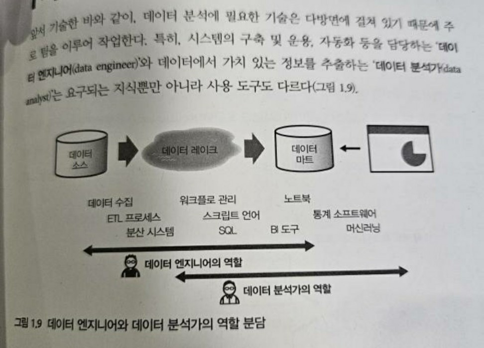

## 왜 이제 와서 이런 글을?
회사는 목적 조직이기 때문에 누군가가 처리해줘야 하는 Ad-hoc 적인 업무를 맡아 진행하는 경우도 발생하게 된다. 데이터에 있어 정합성을 굉장히 중요하게 생각하기도 하고, 꼼꼼하게 데이터를 살펴보는 일에 강점이 있기 때문에 해당 업무들을 종종 맡게 되는 경우가 발생했는데, 해당 업무들을 처리하며 종종 '나는 DE (Data Engineer)라고 이야기할 수 있는 역량을 가지고 있는가?'라는 생각이 들었다.  

이번 기회에 데이터 직군들인 DE, DA (Data Analyst), 그리고 DS (Data Scientist)가 어떠한 R&R을 갖고 있는지 파악해보고, 내가 실제로 회사에서 진행한 업무들은 무엇이었나 되짚어보며 DE로써 앞으로 무엇을 경험하며 살아가야 할지 생각해보려고 한다.  

## 통용되고 있는 데이터 직군에 대한 분류

### Data Analyst (DA)
- 데이터 기반 **의사결정**을 위해 통계적 데이터 **분석 및 시각화**
  - 데이터 분석 보고서 및 시각화 자료를 통해, 비즈니스 결정에서 '추측'에 의한 결정을 없앨 수 있도록 해주고, 서로 다른 팀 간의 중재자 역할을 한다.
- 기술 직군과 비즈니스 직군 사이의 '데이터를 통한' 중재자이기 때문에, 일반적으로 기술 직군이라기보다 경영 및 비즈니스 직군에 가깝다.
- 역량 및 기술
  - 비즈니스 도메인 지식
  - 데이터 시각화 역량 (BI tool - Tableau 등)
  - 데이터 분석을 위한 통계적 지식
  - SQL

### Data Scientist (DS)
- **AI 및 머신러닝** 모델 개발 및 최적화
  - 주요 비즈니스 질문에 ML 모델을 통한 '예측'을 제공한다. 
  - DA가 과거와 현재의 관점에서 데이터를 이해하는 데 초점을 맞춘다면, DS는 미래에 대한 예측을 생성하는 데 초점을 맞춘다.
- 회사에 따라 DA의 업무를 DS가 담당하는 경우도 존재
  - DA 역량에 더해 수학, 통계 역량과 ML modeling 역량을 필요로 하기 때문
- ML Engineer가 따로 있을 경우, DS는 석박사 급 인력들이 AI 모델을 개발하고 리서치, 논문을 내는 연구실의 역할을 맡으며 ML Engineer는 실제 서비스 환경에 맞게 모델을 튜닝해 운영하는 역할을 맡게 된다.
- 역량 및 기술
  - ML, AI에 대한 지식
  - ML 모델 구축을 위한 기본적인 scripting language (Python 등) 코딩 스킬
  - 데이터 분석을 위한 통계적 지식
  - SQL

### Data Engineer (DE)
- 데이터 플랫폼, 파이프라인의 아키텍처 구성 및 개발, 운영
  - DA와 DS가 데이터라는 바다 위에서 자유롭게 헤엄칠 수 있도록 데이터 기반의 플랫폼을 구성하고 데이터를 잘 제공한다.
  - DA, DS보다 **소프트웨어 개발 기술**에 많이 의존하며, **대규모 데이터 처리**를 위해 분산 처리에 대한 기술적 이해도가 필요한 경우가 많다. 
- data storage solution을 설계, 구현하고, ETL 프로세스를 생성하며, 데이터가 정합성에 맞는지, 이슈 없이 access 가능한지 확인, 유지, 관리한다.
- 직군이 세분화되는 경우도 존재한다:
  - Analytics Data Engineer: 분석 업무 지원을 위해 ETL job을 개발 및 운영 (SQL + 중간 수준의 Software Engineering 작업 역량 필요)
    - 이 경우 빅데이터 기술 (Hadoop, Hive)에 대한 이해와 Tableau 등 시각화 툴에 대한 경험, SQL에 대한 역량이 요구됨
  - Data Platform Data Engineer: 데이터 플랫폼 백엔드 아키텍처 및 API를 구성하고 개발 (Software Engineering + DevOps의 역량 필요)
    - 이 경우 Hive, YARN, Spark, Map-Reduce / HBase 등의 빅데이터 기술과 Java / Python Programming Language에 대한 역량이 필요
  - 쏘카에서도 데이터 플랫폼을 만들고 유지보수하는 Data Engineer와 데이터 인사이트를 추출하는 Data Analyst 사이에 Analytics Engineer를 정의하고 있다. 
    - ref. https://tech.socarcorp.kr/data/2022/07/25/analytics-engineering-with-dbt.html
- 역량 및 기술
  - Python, Java, Scala 등 주요 language 코딩 스킬
  - 빅데이터 분산처리 시스템 아키텍처에 대한 이해
  - SQL

## 오.. 그러면 나는 어디에 속하는가?
### 현재 팀에서 진행하는 업무들을 나열해보면?
- 분석 환경 구축을 위해 서비스 운영 DB가 아닌 별도의 저장소를 구축해, 유지 및 보수를 진행하고 있다.
  - 사내에서 자주 사용되는 데이터를 별도로 정제 및 집계해, 일종의 데이터 마트로 만들기도 한다. 
  - 제작한 테이블들에 대한 메타데이터를 정리하는 업무를 진행한다. (사내에 구축된 플랫폼이 존재하기에 따로 Datahub와 같은 framework를 사용하지는 않았다)
- 실제 비즈니스 목적을 가진 분석 지표와 보고서를 만든다.
  - 기획자 분들이 비즈니스 인사이트를 위해 필요한 지표를 정의하면, 우리 팀에서는 백엔드 개발자 분들이 로그의 형태로 남긴 raw data를 집계해 통계 테이블로 제작, Tableau 등의 BI tool에 적용하고 있다.
- 데이터 infrastructure 및 리소스를 관리하고 있다.
  - 데이터 ochestration tool인 Airflow를 유지 및 보수하고 있다.
  - 데이터 적재에 문제가 생겼을 때, 영향이 가는 테이블들을 추출하고 해당 workflow들을 한 번에 실행할 수 있는 시스템을 개발하고 있다. 
  - computing resource (메모리 사용량, CPU 사용량 등)에 대한 모니터링을 진행하고 있다.
  - 데이터 적재에 대한 cost 계산을 통해 과금 효율화를 진행 중이다. 
  - source table 및 target table에 데이터가 평소에 비해 많거나 적게 적재되었는지 정합성을 검사한다.

### 나열한 업무들을 바탕으로 생각해보자면?
- ML 및 AI에 대한 지식을 요구하지는 않고, 팀 내에서는 ML 업무를 진행하는 팀들에 대한 데이터적 서포트를 진행하기 때문에 DS는 아니라고 확실하게 이야기할 수 있다. 
- 데이터를 바탕으로 인사이트를 내는 팀이 따로 존재하고, 우리 팀은 커뮤니케이션을 통해 해당 팀에게 필요한 테이블을 설계하고 Airflow를 통한 파이프라인을 제작하기 때문에 'Analytics Data Engineer' 직군에 속한다고 이야기할 수 있겠다.
  - Tableau를 통해 직접 대시보드를 만들기도 하기 때문에, 'Data Analyst'의 업무도 일부 진행한다. 해당 업무들로 인해 내 직군에 대한 의구심이 들었던 것도 같네..
- 회사의 규모가 크기 때문에 Hive, Spark, HBase, MongoDB 등의 Infrastructure를 관리하는 팀은 따로 존재하고 (Multi-tenant k8s 클러스터를 관리하는 팀도 따로 존재한다!), 우리는 해당 리소스들에 적재된 테이블들을 바탕으로 파이프라인을 제작하기에 'Data Platform Data Engineer'라고 이야기하기에는 무리가 있다 생각한다.
  - 타 팀에서 관리하는 Spark에 옵션들을 추가하거나, Map-Reduce가 어떻게 진행되고 있는지 확인하며 쿼리에 대한 최적화를 진행하고, Airflow on k8s으로 옮겨가기 위해 관련 지식을 습득하고 있기에 해당 도메인에 대한 지식이 아예 없다..고 말할 수는 없다. 사용은 해봤지만, 0 to 1을 구축해봤다는 아닌 정도?

### 팀에서 내가 여태까지 했던 업무들을 나열해보면?
#### 비즈니스 목적을 가진 분석 테이블 구축 및 유지 보수
- 다양한 data source에서 data를 scraping해 dashboard로 만드는 일련의 과정을 겪음
  - prometheus API 환경으로 변경된 metric을 위해 prometheus query를 작성, 기존과 일치하는 통계 데이터를 scrape해 table로 저장
  - Confluence를 통해 작성되는 비정형 outage 문서들을 모두 scrape해 table 및 dashboard의 형태로 유지 보수
- 신규 프로젝트에서 비즈니스와 가장 밀접한 구독 관련 테이블의 구축 및 유지 보수 진행
  - 각 transaction이 기록되어 있는 log data와 해당 transaction이 누적된 aggregate data의 유지 보수 진행
  - 런칭 후 신규로 추가되는 transaction들에 대한 빠른 대응을 위해 정합성이 맞지 않는 유저를 판별하는 대시보드 제작
  - 수시로 데이터 정합성을 비교하며 IAP (In-App Payment) 서버 및 사용자의 액션 로깅 서버에서 잘못 기획된 비즈니스 로직을 3건 정도 발견해 이슈 레이징 진행
- VoIP 관련 신규 지표 반영 및 사용되고 있지 않는 지표 deprecate 진행

#### 데이터 infrastructure 및 리소스 관리
- key 암호화 시스템의 호출 횟수를 최소화하기 위해, Airflow Variable에 해당 metric을 저장하도록 하는 DAG 제작
- Airflow Monitoring
  - docker 환경을 구축해 Airflow에서 보내주는 metric을 prometheus data type으로 변환, 이를 사내 시계열 데이터 시스템에 전송 후 Grafana에서 받아와 대시보드로 제작했다. 해당 시스템에서 memory 사용량을 최적화하기 위해 여러 액션을 진행했다.
  - Airflow 내 DAG 및 task의 retry 및 failure 메시지를 Slack으로 보내주는 flow를 refactoring
- Airflow on K8s 프로젝트 진행 중

### 내가 경험해보고 싶은 업무들은?
- 정리해보면서 놀랐던 점은.. 내가 한 업무들이 까다롭고 Ad-hoc 스러운 업무이기는 하지만 해당 작업을 자동화시킨다면 Analytics DE에 속하는구나라는 것이었다. 어쩌면 Ad-hoc스러운 일들이 모여 DA와 DS가 자유롭게 분석할 수 있도록 돕는 DE에 대한 전문성을 만들어주는구나 라는 하나의 깨달음도 얻었다. 내가 해당 내용에 대해 너무 모른다고 생각했는데... Analytics DE의 관점으로 본다면 생각보다 많이 경험한 것 같기도 하고? 
- 사실 내가 전문성이 없다고 느낀 이유 중에 하나는 '분석 테이블 구축 및 유지 보수'에 초점이 맞춰진 업무들이 많아, Hive, Spark, Presto 등 분산 처리 framework를 Airflow 내에서 사용하는 등의 software engineering 업무들을 거의 진행하지 않았기 때문이었다. 
  - 앞으로 회사에서는 Data Platform DE와 관련된 업무들이나, software engineering 관련된 업무를 진행해보고 싶다는 희망이 있다. 쏘카 개발 블로그에서 온보딩 과제들을 읽어보니 Docker 다루기, 간단한 Webserver 개발하기, Airflow에서 간단한 DAG 만들어서 실행하기, Helm chart를 작성해 웹서버를 K8s에 배포하기 등의 업무를 진행한 것으로 보이는데 현재 나에게 부족하다 생각이 드는 부분은 k8s와 관련된 부분으로 보인다. 해당 부분에 대한 공부는 내가 따로 해도 되는거니까.. 차근차근 DE의 다양한 능력을 쌓아볼까 싶다. 이를 위해 **Kubernetes in Action**이라는 책을 쉬엄쉬엄 읽어볼까 생각 중이다. 
  - ref. https://tech.socarcorp.kr/data/2021/12/28/data-engineering-team-onboarding.html

## TL;DR
- 고민: Ad-hoc적인 업무에 치중되어 Software Engineer 업무를 못하고 있어, DE로써의 경쟁력이 있는지 걱정된다.
- 결론: Analytics DE의 관점에서는 해당 업무가 불필요한 경험이 아니고 오히려 소중하다.
- 액션 플랜: Analytics DE 부분은 강점이 있으니, 회사에는 Data Platform DE 및 Software Engineer 부분을 경험하고 싶다 요구해야겠다.

## Reference
- https://socrates-dissatisfied.tistory.com/entry/%EB%8D%B0%EC%9D%B4%ED%84%B0%EB%B6%84%EC%84%9D%EA%B0%80-vs-%EB%8D%B0%EC%9D%B4%ED%84%B0%EC%97%94%EC%A7%80%EB%8B%88%EC%96%B4-vs-%EB%8D%B0%EC%9D%B4%ED%84%B0%EA%B3%BC%ED%95%99%EC%9E%90%EC%82%AC%EC%9D%B4%EC%96%B8%ED%8B%B0%EC%8A%A4%ED%8A%B8-%EC%B0%A8%EC%9D%B4%EB%8A%94
- https://tech.socarcorp.kr/data/2021/03/24/what-socar-data-engineering-team-does.html
